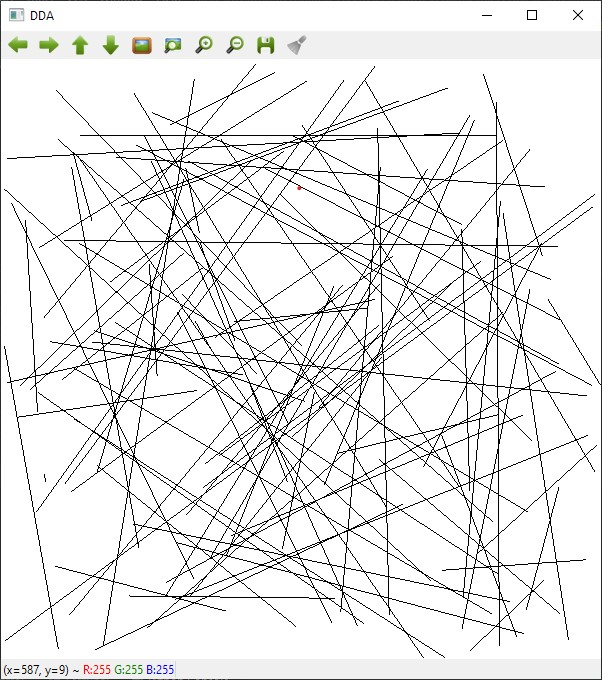

# DDA vs. Brezenham algorithm
In computer graphics, a digital differential analyzer (DDA) is hardware or software used for interpolation of variables over an interval between start and end point. DDAs are used for rasterization of lines, triangles and polygons.
[Read more](https://en.wikipedia.org/wiki/Digital_differential_analyzer_(graphics_algorithm\) "Wikipedia article")

Bresenham's line algorithm is a line drawing algorithm that determines the points of an n-dimensional raster that should be selected in order to form a close approximation to a straight line between two points.
[Read more](https://en.wikipedia.org/wiki/Bresenham%27s_line_algorithm "Wikipedia article")

Example of generated image using DDA.

The task is to compute which of algorithms is most effective through generating 100 random segments using both algorithms. 

For drawing segments we need their 2 edge points. We can get random points using Python's built-in function random.uniform(). For comparing the time used for drawing of each algorithm we need to make them draw *same* lines